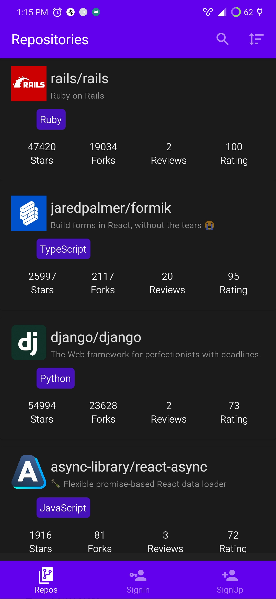
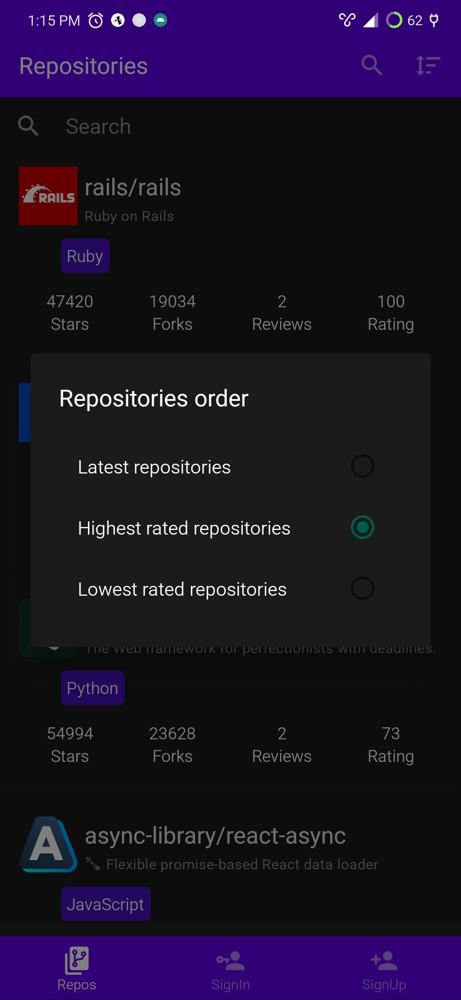
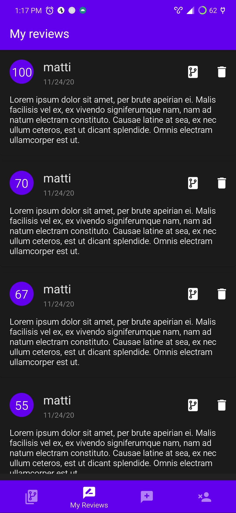

# FullStack dev challenge - React Native

## GitHub repositories application
* This react native based application works with a graphQL [backend service](https://github.com/fullstack-hy2020/rate-repository-api). Follow the repository instructions in order to run the backend service and to propagate the initial data.

1. Before run the application set an `.env` file in the root of the folder application with the next content
```
ENV=development
APOLLO_URI=http://192.168.0.22:5000/graphql
```
* Here `192.168.0.22` should be your local ip address.

2. Run the application with
```
$ npm start
```

3. The expo development enviroment should start soon, hence you could launch the application as a web application (not too recomended) and you could aldo connect and android phone (best option, used to develop the application itself).



